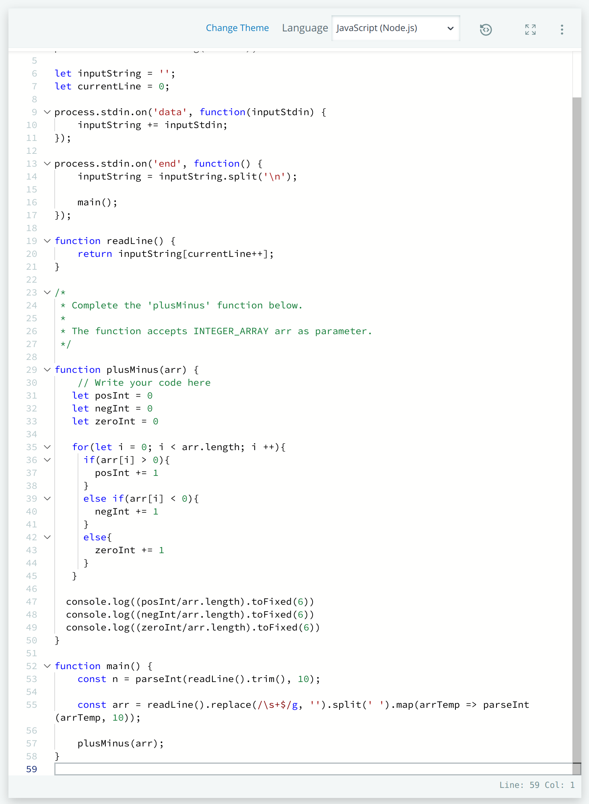
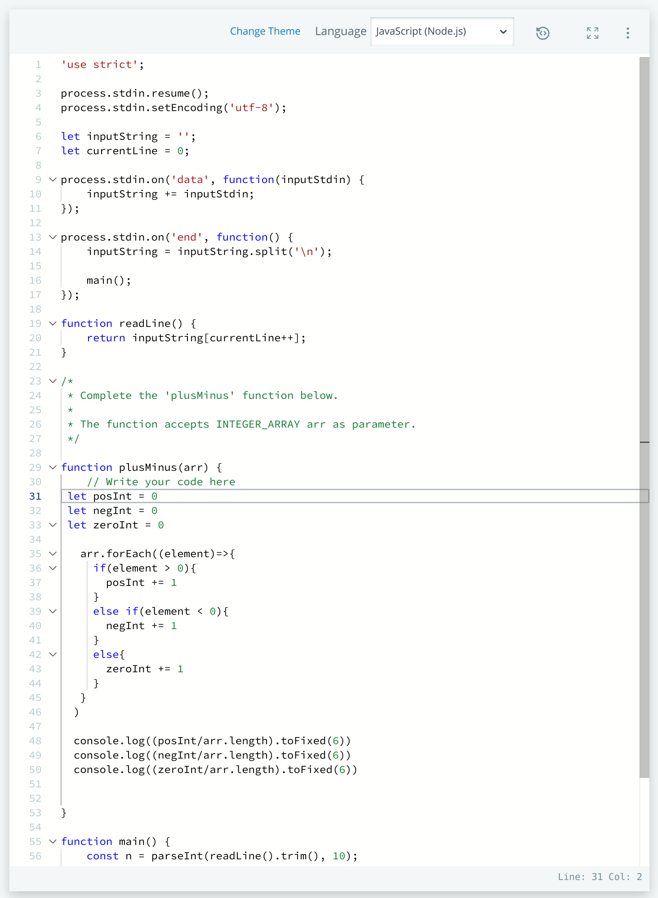

# Hackerrank Challenge - Plus Minus

## Problem Description
An array containing numbers of various signs is given. Find the ratio of numbers that are positive, nagative and zero to 6 decimal places. 

The Hackerrank provided example:

 ``` JavaScript
 arr = [1,1 0, -1, -1]
 ```

The ratios in the array above are calculated using the following formula:

`Number Of Elements/Length of Array = Decimal Ratio`

Using this, we perform all three calculations:

Positive

`2/5 = 0.400000`

Negative:

`2/5 = 0.400000`

And, Zero:

`1/5 = 0.200000`

## Solution
To solve this using JavaScript, a counter variable for Positive Integers, Negative Integers and Zero Integers is declared

 ``` JavaScript
 let posInt = 0
 let negInt = 0
 let zeroInt = 0
 ```
A loop method is used to cycle over all the elements in the `.arr` array of elements passed into the `plusMinus(arr)` already declared in Hackerrank. The current element being selected by the element is printed out the the console for verification.

 ``` JavaScript
   arr.forEach((element)=>{
    console.log(element)
   }
  ) 

 ```
Next, conditionals are used to check if its a positive number `if(element > 0){}`, negative `else if(element < 0){}`, and any other conditional (in this case would be Zero) `else{}`

 ``` JavaScript
   arr.forEach((element)=>{
     if(element > 0){
       posInt += 1
     }
     else if(element < 0){
       negInt += 1
     }
     else{
       zeroInt += 1
     }
   }     
  )
 ```
 When each conditional is met, the corresponding integer is iterated by one. For example, if the current number is `1`, the conditional 

 ``` JavaScript
     if(element > 0){
       posInt += 1
     }
 ```
Will be instigated and the `posInt` variable will iterate by 1.

Hackerrank asks to print each ratio out to the console, so the final step is performed outside of the `forEach()` loop method:

 ``` JavaScript
  console.log((posInt/arr.length).toFixed(6))
  console.log((negInt/arr.length).toFixed(6))
  console.log((zeroInt/arr.length).toFixed(6)) 
 
 ```

The ratio is calculated within the `console.log()` method. Using the Positive ratio as an example again, the final value stored in `posInt` is divided by the length of the array using `arr.length`. The result is then converted to a number with a minimum 6 decimal places using the `.toFixed()` method. 


## Refactoring for Optimization
This problem uses a method to cycle through each element in `arr`. the `forEach()` method has a slower run time compared to a `for()` loop according to the article in refernce 1 below.

Because of this, the solution was modified by replacing the `forEach()` with a `for()` loop.

 ``` JavaScript
function plusMinus(arr) {
    // Write your code here
   let posInt = 0
   let negInt = 0
   let zeroInt = 0
   
   for(let i = 0; i < arr.length; i ++){
     if(arr[i] > 0){
       posInt += 1
     }
     else if(arr[i] < 0){
       negInt += 1
     }
     else{
       zeroInt += 1
     }
   }
 
  console.log((posInt/arr.length).toFixed(6))
  console.log((negInt/arr.length).toFixed(6))
  console.log((zeroInt/arr.length).toFixed(6)) 
}
 
 ```

## Hackerrank Submission & Acceptance 
### Submissions Accepted


### Code Submissions





## References
1. [Optimal Loops](https://blog.bitsrc.io/finding-the-fastest-loop-type-in-javascript-38af16fe7b4f)