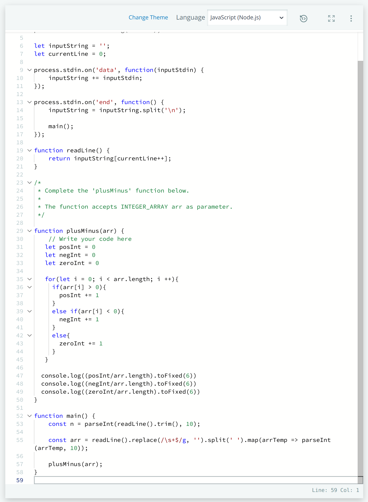
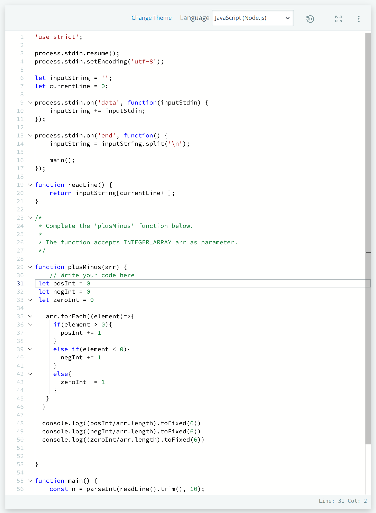

# Hackerrank Challenge - Mini Max

## Problem Description
An array of 5 integers is given. Find the minimim and maximum sum using four of the integers 

Example

 ``` JavaScript
 arr = [1, 3, 5, 7, 9]
 ```
Because this array is already in ascending order, the first 4 numbers `1, 3, 5, 7` summed will be equal to `16`. This is the `lowest sum`

To calculate the highest sum, we eliminate the lowest numbers from the array leaving 4 elements. In this case, because there is only 5 in the array, only `1` needs to be removed. So the `highest sum` will be `24`


## Solution
To solve this using JavaScript, two sum variables are decalred for the low and the high sum. Next, a copy of the original array is made using `[..arr]` so that `sort()` and `reverse()` JavaScript method can be used to create two separate arrays for processing

 ``` JavaScript
 let lowSum = 0
 let highSum = 0
 let ascending = [...arr].sort()
 let descending = [...arr].sort().reverse()
 ```
The `ascending` variable sorts the integers into ascending order so that the first four values in the array will be the lowests

`descending` will make a copy of `arr`, sort the integers and then reverse the array so that the first four integers in the array are the largest.

After this, a single for loop will iterate from position 0 up to 3. Each position from both the `ascending` and `descending` arrays will be stored as a sum in `sumLow` and `sumHigh` respectively. 


 ``` JavaScript
  for(let i = 0; i < 4; i++){
    sumLow += ascending[i]
    sumHigh += descending[i]
  }
 ```
Finally, outside of the `for()` loop is a `console.log()` printing out the lowest and highest as spaced integers in string format. Each variable is inputted using a template literal

 ``` JavaScript
console.log(`${sumLow} ${sumHigh}`)
 ```

## Refactoring for Optimization
The chosen solution uses a JavaScript method to cycle through each element in `arr`. The `forEach()` method has a slower run time compared to a `for()` loop according to the article in reference 1 below.

Because of this, the solution was modified by replacing the `forEach()` with a `for()` loop.

 ``` JavaScript
function miniMaxSum(arr) {
    // Write your code here
  let min = 0
  let max = 0

  for(let i=0; i<arr.length; i++){
    max += arr[i]
    min += arr[i]
  }
  max -= Math.min(...arr)
  min -= Math.max(...arr)
  console.log(min + ' ' + max)
}
 ```

## Hackerrank Submission & Acceptance 
### Submissions Accepted


### Code Submissions





## References
1. [Optimal Loops](https://blog.bitsrc.io/finding-the-fastest-loop-type-in-javascript-38af16fe7b4f)