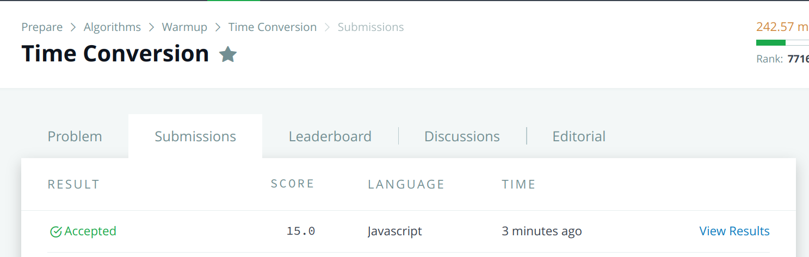
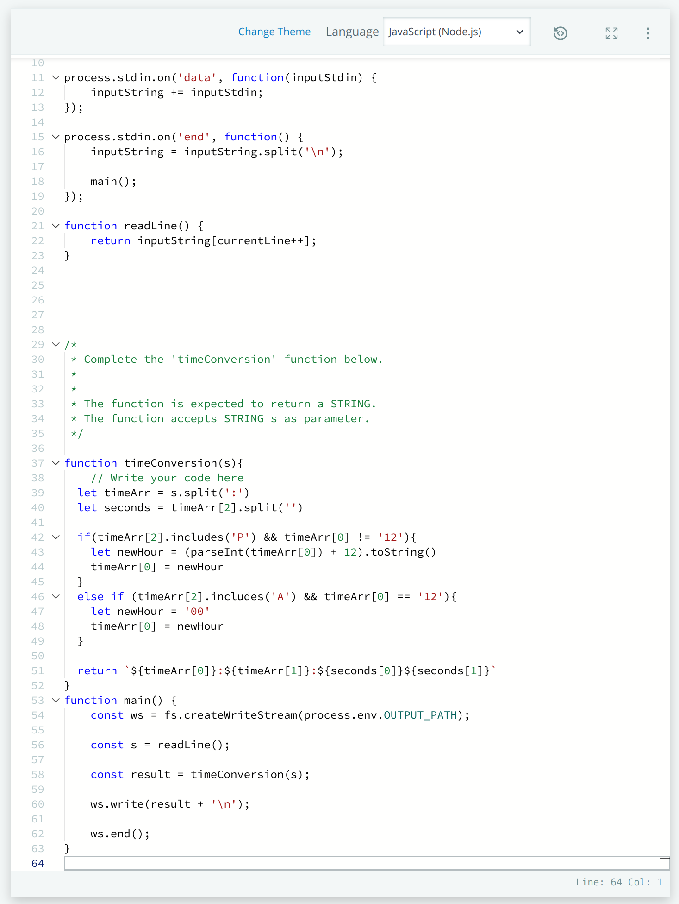

# Hackerrank Challenge - Time Conversion

## Problem Description
Given hours, minutes, seconds and AM or PM as a combined string, convert to military time, i.e. a 24hour clock. 

Example

 ``` JavaScript
 s = '12:01:00PM'
 ```

This will no change because it is showing 12 noon. The output will be `12:01:00` excluding `PM` - this is not required on a 24hr clock


## Solution
First, the string is split up into hours, minutes and seconds. The `.split()` method is used to break up the string into an array using `:` character.

Seconds require a separate `.split()` method call because it is combined with `AM` or `PM`

 ``` JavaScript
  let timeArr = s.split(':')
  let seconds = timeArr[2].split('')
 ```

A conditional is used to check if the last string entry of the `timeArr` array contains a `P` character using `.includes()` method. Also, we are checking if the hour `timeArr[0]` is not equal to 12. This is because 12 noon is not represented as `24` because its still in the middle of the day and `24` is never shown on a 24hr clock (it resets to `00` hours at midnight).

The `newHour` variable sets the hour converted to a 24hr clock. First, it takes `timeArr[0]` - the hour, and converts to an integer. Then, 12 is added to the number before it is converted back to a string. The hour in `timeArr[0]` is then set to the converted hour, `newHour`.

 ``` JavaScript
  if(timeArr[2].includes('P') && timeArr[0] != '12'){
    let newHour = (parseInt(timeArr[0]) + 12).toString()
    timeArr[0] = newHour
  }
```

The last conditional to consider is when the time is `AM` and if the hour `timeArr[0]` is equal to 12. This is the start of a new day, so it will get converted to `00`

``` JavaScript
  else if (timeArr[2].includes('A') && timeArr[0] == '12'){
    let newHour = '00'
    timeArr[0] = newHour
  }
```

To return the correct string, a temp literal is used to combine the final output string. The original `timeArr` after any conditional changes is split up based on the positions in the array, which represent the hours and minutes. The first and the second position in the `seconds` array will be the seconds needed to be outputted without `AM` or `PM` at the end.

``` JavaScript
  return `${timeArr[0]}:${timeArr[1]}:${seconds[0]}${seconds[1]}`
```


## Refactoring for Optimization
No refactoring can be observed at this time, but will be revisited with more hackerrank practice. The aim would be to reduce the number of JavaScript methods being used to save on processing time. 

## Hackerrank Submission & Acceptance 
### Submissions Accepted



### Code Submissions



